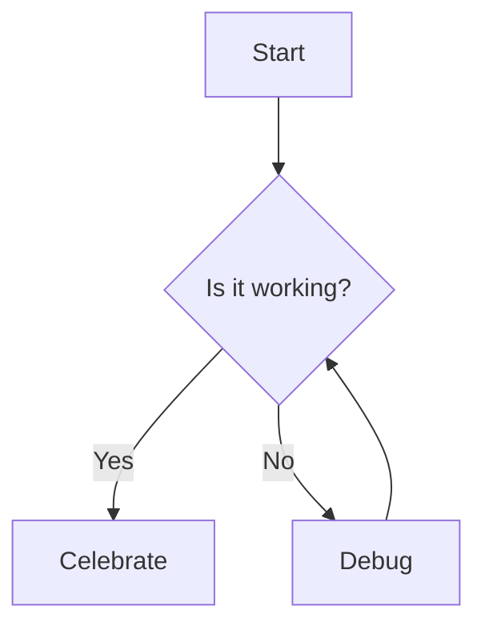

# Plan Command

This command invokes the **planner** agent to create a comprehensive implementation plan before writing any code.

## What This Command Does

1. **Restate Requirements** - Clarify what needs to be built
2. **Identify Risks** - Surface potential issues and blockers
3. **Create Step Plan** - Break down implementation into phases
4. **Wait for Confirmation** - MUST receive user approval before proceeding

## When to Use

Use `/plan` when:

- Starting a new feature
- Making significant architectural changes
- Working on complex refactoring
- Multiple files/components will be affected
- Requirements are unclear or ambiguous

## How It Works

The planner agent will:

1. **Analyze the request** and restate requirements in clear terms
2. **Break down into phases** with specific, actionable steps
3. **Identify dependencies** between components
4. **Assess risks** and potential blockers
5. **Estimate complexity** (High/Medium/Low)
6. **Present the plan** and WAIT for your explicit confirmation

## Example Usage

```
User: /plan I need to add real-time notifications when markets resolve

Agent (planner):
# Implementation Plan: Real-Time Market Resolution Notifications

## Requirements Restatement
- Send notifications to users when markets they're watching resolve
- Support multiple notification channels (in-app, email, webhook)
- Ensure notifications are delivered reliably
- Include market outcome and user's position result

## Implementation Phases

### Phase 1: Database Schema
- Add notifications table with columns: id, user_id, market_id, type, status, created_at
- Add user_notification_preferences table for channel preferences
- Create indexes on user_id and market_id for performance

### Phase 2: Notification Service
- Create notification service in lib/notifications.ts
- Implement notification queue using BullMQ/Redis
- Add retry logic for failed deliveries
- Create notification templates

### Phase 3: Integration Points
- Hook into market resolution logic (when status changes to "resolved")
- Query all users with positions in market
- Enqueue notifications for each user

### Phase 4: Frontend Components
- Create NotificationBell component in header
- Add NotificationList modal
- Implement real-time updates via Supabase subscriptions
- Add notification preferences page

## Dependencies
- Redis (for queue)
- Email service (SendGrid/Resend)
- Supabase real-time subscriptions

## Risks
- HIGH: Email deliverability (SPF/DKIM required)
- MEDIUM: Performance with 1000+ users per market
- MEDIUM: Notification spam if markets resolve frequently
- LOW: Real-time subscription overhead

## Estimated Complexity: MEDIUM
- Backend: 4-6 hours
- Frontend: 3-4 hours
- Testing: 2-3 hours
- Total: 9-13 hours

**WAITING FOR CONFIRMATION**: Proceed with this plan? (yes/no/modify)
```

## Useful tip

### Codeblock Attributes

Inkdrop supports additional codeblock syntaxes for better readability.
It can have `line`, `title`, `filename`, `commit`, and `url` attributes.
For example:

```typescript line=70 commit=f58b8ee url=https://github.com/inkdropapp/mcp-server/blob/f58b8ee08c7fabd134dfe33f78af34b1cff7487e/src/index.ts#L70-L77
server.tool(
  'search-notes',
  `List all notes that contain a given keyword.
The result does not include entire note bodies as they are truncated in 200 characters.
You have to retrieve the full note content by calling \`read-note\`.
Here are tips to specify keywords effectively:

## Use special qualifiers to narrow down results
```

```js filename="hoge.js" title="Sample Code" line=2
function foo(bar) {
  console.log(bar);
  const a = false;
  return true;
}
```

Use them in your codeblocks within the plan steps as needed.

### Diagrams with Mermaid

When helpful, include architecture diagrams or flowcharts, using Mermaid codeblocks:



### Math with LaTeX

For complex logic, represent algorithms or calculations using LaTeX within markdown codeblocks:

```math
\begin{align*}
E &= mc^2 \\
F &= ma
\end{align*}
```

## Important Notes

**CRITICAL**: The planner agent will **NOT** write any code until you explicitly confirm the plan with "yes" or "proceed" or similar affirmative response.

If you want changes, respond with:

- "modify: [your changes]"
- "different approach: [alternative]"
- "skip phase 2 and do phase 3 first"

## Integration with Other Commands

After planning:

- Use `/tdd` to implement with test-driven development
- Use `/build-and-fix` if build errors occur
- Use `/code-review` to review completed implementation

## Related Agents

This command invokes the `planner` agent located at:
`~/.claude/agents/planner.md`
